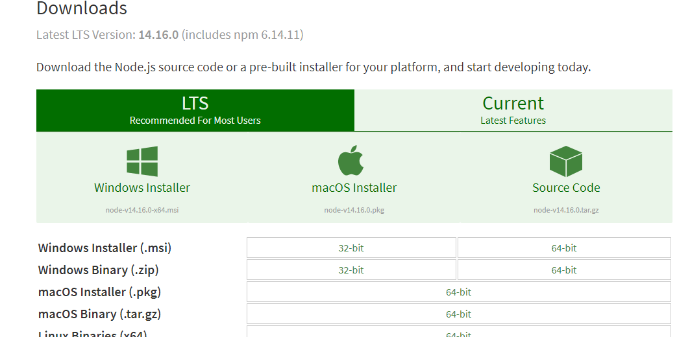

# 复杂度分析1：如何分析、统计算法的执行效率和资源消耗？

## 1、数据结构和算法主要解决的是什么问题？

数据结构和算法本身解决的是**"快"和"省"**的问题，即**如何让代码运行得更快，如何让代码更节省存储空间**。所以，**执行效率是算法的一个非常重要的考量指标**。

## 2、如何衡量算法代码的执行效率？

那么如何来衡量你写的算法代码的执行效率呢？这里就要用到：**时间复杂度分析、空间复杂度**分析。只要讲到数据结构和算法，就离不开时间复杂度分析和空间复杂度分析。而且，我认为，**复杂度分析是整个算法学习的精髓，只要掌握了复杂度分析，数据结构和算法的内容基本上就掌握了一半**。

## 3、为什么需要复杂度分析？

新手菜鸟可能会有疑惑，我把代码跑一遍，通过统计、监控，就能得到算法执行的时间和占用的内存大小。为什么还要做时间、空间复杂度分析呢？这种分析方法能比我实实在在跑一遍得到的数据更准确吗？  

首先，我可以肯定地说，你这种评估算法执行效率的方法是正确的。很多数据结构和算法书籍还给这种方法起了一个名字，叫**事后统计法**。但是，这种统计方法有非常大的局限性。  
[godweiyang.com](https://godweiyang.com/)

**(1) 测试结果非常依赖测试环境**

测试环境中硬件的不同会对测试结果有很大的影响。比如，我们拿同样一段代码，分别用Intel Core i9 处理器和 Intel Core i3 处理器来运行，不用说，i9 处理器要比 i3 处理器执行的速度快很多。还有，比如原本在这台机器上 a 代码执行的速度比 b 代码要快，等我们换到另一台机器上时，可能会有截然相反的结果。  

**(2) 测试结果受数据规模的影响很大**
后面我们会讲排序算法，我们先拿它举个例子。对同一个排序算法，待排序数据的有序度不一样，排序的执行时间就会有很大的差别。极端情况下，如果数据已经是有序的，那排序算法不需要做任何操作，执行时间就会非常短。除此之外，如果测试数据规模太小，测试结果可能无法真实地反应算法的性能。比如，对于小规模的数据排序，插入排序可能反倒会比快速排序要快！
所以，我们需要一个不用具体的测试数据来测试，就可以粗略地估计算法的执行效率的方法。这就是我们今天要讲的时间、空间复杂度分析方法  

