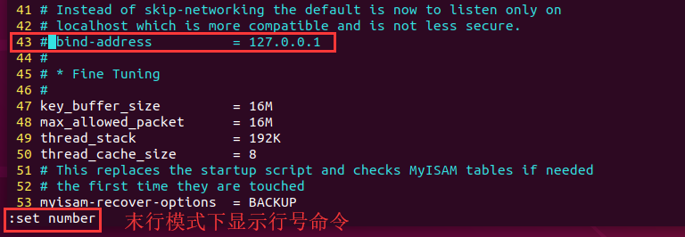

## 1、安装

```shell
# 查看有没有安装MySQL,没有安装继续执行以下命令
dpkg -l | grep mysql

#更新软件源
sudo apt-get update 
#安装mysql
sudo apt-get install mysql-server  

# 启动和关闭mysql服务器：
service mysql start
service mysql stop
```


## 2、检查相关配置

```shell
# 安装完成之后可以使用如下命令来检查是否安装成功：
sudo netstat -tap | grep mysql

# 登录mysql数据库可以通过如下命令
# -u 表示选择登陆的用户名， -p 表示登陆的用户密码，现在是mysql数据库是没有密码的，Enter password:处直接回车，就能够进入mysql数据库。
mysql -u root -p


```

```shell
# 解决利用sqoop导入MySQL中文乱码的问题（可以插入中文，但不能用sqoop导入中文）导致导入时中文乱码的原因是character_set_server默认设置是latin1 可以单个设置修改编码方式set character_set_server=utf8;但是重启会失效，建议按以下方式修改编码方式。
mysql -u root -p

# 并查看MySQL目前设置的编码
mysql> show variables like "char%";
```


```shell
# 在[mysqld]下添加一行character_set_server=utf8。如下图
sudo vi /etc/mysql/mysql.conf.d/mysqld.cnf
# 重启MySQL服务
service mysql restart
```


```shell
# 登录
mysql -u root -p
# 并查看MySQL目前设置的编码
# 完成编码方式的修改后，即解决了sqoop导入MySQL中文乱码的问题。至此，ubuntu系统上顺利完成安装mysql数据库。
mysql> show variables like "char%";
```


```shell
# 检查mysql服务状态：
systemctl status mysql
```


```shell
# 处输入刚设置的密码，回车，就能够进入mysql数据库。
mysql -u root -p命令，
Enter password:

mysql> use mysql; 
# 命令打开mysql命名的数据库，显示当前数据库的表：
mysql> show tables; 
#查询user表里的数据：
mysql> select * from user;
（user表里是mysql数据库的所有账户信息）
```


## 3、配置外网


```shell
# 现在配置mysql允许远程访问，首先编辑 /etc/mysql/mysql.conf.d/mysqld.cnf 配置文件：
vim /etc/mysql/mysql.conf.d/mysqld.cnf
# 注释掉bind-address          = 127.0.0.1
```





```shell
mysql -u root -p
# 配置外网访问
mysql> grant all on *.* to root@'%' identified by 'ars123456' with grant option;

# 配置内网访问
mysql> grant all on *.* to root@'127.0.0.1' identified by 'ars123456' with grant option;
mysql> grant all on *.* to root@'localhost' identified by 'ars123456' with grant option;
# 刷新权限
mysql> flush privileges;    
mysql> exit
```
